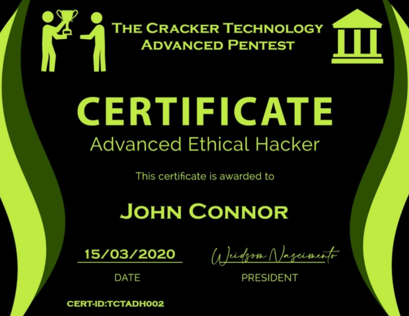

# [ANDRAX Hackers Platform](https://andrax.thecrackertechnology.com/)
## [Course](https://thecrackertechnology.com/) ANDRAX Mobile Pentest

## Advanced Hacking Training
### The most Advanced and complete Ethical Hacking and Penetration Testing Training

#### 21 Modules and 1 Bonus Modules
- Beginner to Advanced
- LIFETIME ACCESS
- CTF and LABS
- PDF BOOKS

#### The Best Certification More Advanced than CEH/OSCP/OSWE/OSCE/OSEE/OSWP together

#### Who is this training for?
- ➢ Anybody who want be a Penetration Tester and Ethical Hacker.
- ➢ Security professionals who want improve skills with a Advanced Training.
- ➢ Server and Network Administrators that need build secure systems.
- ➢ Anybody interested in Bug Bounty campaigns to earn money with Hacking

## Learn with the bests
#### The Creators of new world technologies
## ANDRAX Hackers Platform
#### The most Advanced Platform for Hacking, Cracking and Penetration Testing

## M.A.R.I.N.A AI For Hacking
#### Advanced Artificial Intelligence for Network Attacks and Hacking

## Why the low price?
### Our course is the best ever made… so why the low price?
### The training is in LIVE PRODUCTION
### What this mean?
#### This mean that we are recording and building the lessons, you will see new lessons every week in your student dashboard.
### ATTENTION!!!
### LIFETIME ACCESS
#### This training is your for your entire life and we ever will keep it and your certification updated, you are investing in your future!

## How to pay?
### We have simplified payment options
- PayPal : The Best way to pay online, receive your access in a some hours and have a money back guarantee within 4 months of purchase
- Payoneer : Global Payments Made Easy with just your credit or debit card, receive your access in 3 commercial days.

##### Our team will select the best option to your country!
## How to pay?
### Simple way to join
### Invoice Generation
#### Our team will generate a invoice to you, we only need:
- ➢ Your full name
- ➢ Your country

#### We will send your invoice and a payment link with the best option to you.
### You will receive a TEMPORALLY access until the payment is complete

## The teacher
### Weidsom Nascimento

#### Security Researcher, Security consultant and Penetration Tester at The Cracker Technology and PayBack Security. 22 years old Started in Hacking at 8 years old, at 10 started working as Penetration Tester. Developer in: C, C++, Go, Ruby, Perl, Java, PHP, Lua, Python, Assembly x86, Assembly x86_64, Assembly ARM, Assembly MIPS and many others...

#### Creator of the Penetration Testing platform for Android smartphones: ANDRAX - Creator of M.A.R.I.N.A. the first Advanced AI for Penetration Testing Network and Security system administrator expert

## What Did Weidsom Hacked
- ➢ Claro Mobile CellPhone Operator (HLR/HSS, eNodeB, NodeB, free internet data, SIM Swap, Clone number)
- ➢ VIVO Mobile CellPhone Operator (HLR/HSS, eNodeB, NodeB, free internet data)
- ➢ Hostinger host provider
- ➢ Windows Desktop’s
- ➢ Windows Server’s
- ➢ Linux and *NIX Machines
- ➢ Routers around the world
- ➢ Fillnet ISP
- ➢ Mconect ISP
- ➢ Mikrotik RouterOS
- ➢ PLC’s, SCADA and others Industrial Control Systems
- ➢ WebSites
- ➢ Cars
- ➢ Satellites
- ➢ And much more...

____________________________________

## What will you learn?
### 22 modules about Hacking and Penetration Testing:
- 01 Networking
- 02 *NIX Basics
- 03 Programming for Hacking
- 04 Information Gathering
- 05 Scanning
- 06 Password Hacking
- 07 WebSite Hacking
- 08 Wireless
- 09 SDR Hacking
- 10 Exploitation
- 11 Windows Hacking
- 12 MacOS Hacking
- 13 Linux Hacking
- 14 Android Hacking
- 15 IOS Hacking
- 16 Advanced Phishing
- 17 IoT Hacking
- 18 ICS Hacking
- 19 Mobile Network Hacking
- 20 Hardware Hacking
- 21 Car Hacking
- 22 Artificial Intelligence for Hacking

____________________________________

### 01 Networking
##### Learn networking is essential for everyone who want to become a professional hacker!
- Network Basics
- IPv4 
- IPv6 
- OSI vs TCP Models
- UDP
- SCTP
- FTP
- SSH
- HTTP
- ISP (Internet Service Provider)
- Routers
- Switchs
- VLAN's
- Cisco
- Ubiquiti
- Mikrotik

 

### 02 *NIX Basics
##### You need to know how the operating system works to hack it… more than 80% of the entire internet is Linux and if you don’t know about it… sorry you are not a hacker!
- Linux Structure
- Linux users
- Linux groups
- Linux permissions
- Linux passwords
- Shell
- Limited shell
- Basic commands
- Shell Scripting
- Important files

 

### 03 Programming for Hacking
##### Know how to code in the major languages is a thing that a professional need to know, don't trust in anyone who says the opposite!
- C
- C++
- Python
- Go
- Ruby
- PHP
- Java
- Kotlin
- Perl
- JavaScript

 

### 04 Information Gathering
##### Information Gathering is the first and one of the most important phase in the Penetration Testing, you need be a expert in this phase to get better options to conclude your hack!
- OSINT
- Passive Information Gathering
- Whois
- DNS Recon
- Subdomain enumeration
- Theharvester
- Shodan
- Active Information Gathering
- DNS brute force
- Subdomain bruteforce
- Amass
- ReconDOG
- Raccoon
- X-RAY

 

### 05 Scanning
##### Scanning allow us discover daemons and services running in the targets machines. Is a crucial phase to perform a good test.
- Passive Scanning
- Shodan scan
- Syn Stealth scan
- Nmap evasion
- 0trace
- Smtp scan
- Snmp scan
- Ssh Scan
- Active Scan
- Nmap TCP scan
- Nmap UDP Scan
- Nmap NSE (Nmap Script Engine)
- Masscan for big network
- NBTScan

 

### 06 Password Hacking
##### Learn how to break passwords and bypass authentication methods using mixed attacks.
- Wordlists
- Rainbow Tables
- Authentication Protocols
- How to avoid brute force protections
- How to bypass 2fa

 

### 07 Web Site Hacking
##### In this module you will learn more about Web Site Hacking the most good paid type of test and one of the best to hijack a company.
- Information Disclosure
- Insecure Admin Access
- Directory Listing
- Directory Traversal
- Abuse Of Functionality
- Arbitrary File Creation
- File Inclusion
- Unauthenticated File Upload
- Authentication Bypass
- Default Credentials
- Dev Files
- Http Parameter Pollution
- Http Response Splitting
- CSRF
- SSRF
- XFS
- XSS
- XXE
- Xpath Injection
- Crlf Injection
- Ldap Injection
- Sql Injection
- Code Execution
- Configuration
- Error Handling
- Session Fixation
- Source Code Disclosure
- Url Redirection
- W3 Total Cache
- Weak Credentials

 

### 08 Wireless
##### Learn how to Hacking Wireless technologies, nowadays wireless things are in everywhere and we can use this to improve our success rates!
- Enable monitor mode on non-native devices
- Create EVIL-TWIN AP
- Hack WEP
- Hack WPA2
- Hack WPA3
- Hack WPA Enterprise Edition (All versions)
- Hack routers users
- BlueZ Bluetooth Stack Hacking

 

### 09 SDR Hacking
##### SDR (Software Defined Radio) is pretty good when used by a professional, with SDR we can make a lot of connections type and we can hack practically everything who use Radio signals.
- How to setup Kernel Drivers
- Cables
- SDR Basic
- HackRFOne

 

### 10 Exploitation
##### Exploitation is more than just run metasploit, pro hackers don't use metasploit, in this module you will learn how to make exploits by hands using your own tools!
- Assembly x86
- Assembly x86_64
- Assembly ARM
- Assembly MIPS
- Shellcoding
- Buffer Overflow
- Format String Bugs
- Fuzzing

 

### 11 Windows Hacking
##### Learn how to hack Windows motherfucker machines by many ways, dumbs use Windows and 90% of people in the earth are dumb so we need know how to hack this!
- Bypass windows security systems
- How to exploit SMB
- How to make 100% undetectable malwares
- Write malicious patchs
- Hack via Windows OTA like
- Bypass Windows defender
- Break Windows firewall
- Elevate privileges

 

### 12 MacOS Hacking
##### MacOS is the operating system used by dumbs who think they are smart, many business guy use it so is useful know how to hack it!
- Exploit MacOS Updates
- Exploit Safari
- Bypass MacOS encryption
- Write malwares for MacOS
- Hook functions in MacOS Kernel
- Pivoting
- Privilege Escalation

 

### 13 Linux Hacking
##### Nowadays everything is Linux, if you know how to hack Linux machines you are able to hack anything like: Servers, Routers, Desktop, Mobile...
- Bypass Firewalls
- Bypass IDS
- Bypass IPS
- Try break distro packages repository
- Write malwares for Linux
- Pivoting
- Privilege Escalation

 

### 14 Android Hacking
##### Android is the most used Operating System on smartphones, is extremely essential to us know how to hack Android devices!
- How to exploit Android WebView
- Hijack users applications
- Exploit Apps API
- Build Android malwares
- RAT on Android
- Bypass Android permissions!

 

### 15 IOS Hacking
##### IOS is the Apple Operating System for they smartphones, dumbs think that Iphone is secure but this is a big mistake!
- Hack IOS by SWIFT
- Write malwares for IOS
- Remote control IOS devices
- (The same things who work for MacOS Hacking work for IOS too)

 

### 16 Advanced Phishing
##### In this module you will learn the next level of phishing campaigns, many dumbs on youtube think that shellphish and hiddeneye is "advanced" phishing tool... come on... only others dumbs will caught in this!
- Create and manage phishing campaign in Gophish
- Bypass 2FA using EvilGINX2
- How to make EvilGINX2 phishlet
- Advanced reverse proxy to hack HTTPS and 2FA using modlishka
- Write modlishka configuration files

 

### 17 IOT Hacking
##### IoT (Internet of Things) grow up every single day with more "smart" devices in the market, cultures like "maker" culture create a false perspective of the IoT, we are downgrading our security every day, nowadays a lot of homes are 100% automated by IoT... so, know how to hack it is more than a need!
- Determine the device
- Hack IoT protocols
- Exploit IoT credentials
- Find vulnerabilities in devices
- Hijack connections

 

### 18 ICS Hacking
##### ICS (Industrial Control System) Hacking is a topic less widespread in the Penetration Testing but is so important to Advanced Hackers, ICS are in everywhere, if you can hack industrial machines you can hack anything, this is the last door to open!
- Find PLC devices
- Exploit PLC flows
- Hack LLC
- Hack TCP/IP S7comm
- Hack by modbus
- Exploit SIXNET RTU's
- Hijack PLC sessions
- Lateral write

 

### 19 Mobile Network Hacking
##### Mobile network technologies is essential in our world nowadays, mobile networks are pretty hard to hack but when you do that, you get a big power in your hands. In this module we will learn about mobile network Penetration Testing.
- Build a femtocell
- Hack 3G from Android
- Hack 4G LTE from Android
- Bypass HSS/HLR
- Build a NodeB
- Build a E-NodeB
- Setup your own Cell Phone Operator
- Free CALLS
- Free SMS
- Free Internet
- Intercept calls
- Clone cellphone ID
- Clone cellphone number

 

### 20 Hardware Hacking
##### In this module you will learn how to build your own hardware tools and how to hack non-managed devices to improve features or bypass something.
- Analog eletronic
- Digital eletronic
- Protocol for hardware communication
- EPROM Hacking
- EEPROM Hacking

 

### 21 Car Hacking
##### Learn how to hack Cars with advanced techniques and cracking the best auto technologies.
- Hardwares for hacking Car's
- Cables
- BUS Protocols
- OBD-II Hacking
- CAN Hacking
- ECU Hacking
- Hacking Car by Bluetooth (BlueZ STACK)

 

### 22 Artificial Intelligence for Hacking
##### In Ethical Hacking Artificial Intelligence systems are used by professionals to work together with your skills and perform ways to hack that a human can't do very well. In this module you will learn about AI for Penetration Testing.
- Supervised Learning
- Unsupervised Learning
- AI controller from C
- AI controller from Python
- Classification of data
- Attack result learning
- Attack result classification
- Action by data

____________________________________

## Why our Training is better?
##### Our training is the most advanced training in the market, with our training you not will learn how to use tools. You will learn how to make your own tools! You will see the real hacking attacks in real world, you will get a advanced certificate, learning with us you don’t need learn more nothing because our training is updated every month. You only pay one time and can access the training for you entire life with free updates. At the end of the training you can work with us, earning money in our Penetration Testing campaigns
## JOIN RIGHT NOW.
##### Become a Advanced Hacker now! Advanced Hacking Training.
